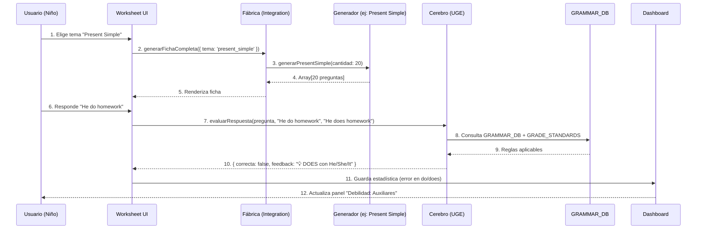

# 🏛️ ARQUITECTURA COMPLETA - SISTEMA DE INGLÉS
## EduAnalytics v2.0 - Universal Grammar Engine (UGE) v1.0

---

## 📋 ÍNDICE
1. [Visión General](#visión-general)
2. [Arquitectura Modular](#arquitectura-modular)
3. [Flujo de Datos](#flujo-de-datos)
4. [GRAMMAR_DB](#grammar_db)
5. [GRADE_STANDARDS](#grade_standards)
6. [Capas de Evaluación](#capas-de-evaluación)
7. [Ejemplo de Flujo Completo](#ejemplo-de-flujo-completo)

---

## 🎯 VISIÓN GENERAL

El sistema de Inglés de EduAnalytics está diseñado como una **arquitectura modular de 4 pilares**:

```
┌─────────────┐    ┌─────────────┐    ┌─────────────┐    ┌─────────────┐
│   FÁBRICA   │───→│   CEREBRO   │───→│    LEYES    │───→│  DASHBOARD  │
│ Generadores │    │     UGE     │    │ Gramática   │    │  Métricas   │
│  Dinámicos  │    │ evaluación  │    │  Taxonomía  │    │  Análisis   │
└─────────────┘    └─────────────┘    └─────────────┘    └─────────────┘
```

---

## 🏗️ ARQUITECTURA MODULAR

### 1️⃣ LA FÁBRICA (Generación de Contenido)

**Archivo Principal:** `english-integration-4primaria.js`

**Responsabilidad:** Orquestador central que delega la creación de ejercicios a generadores especializados.

**Generadores Disponibles (31 módulos):**
- `english-vocabulary-4primaria.js` - Vocabulario dinámico
- `english-present-simple-4primaria.js` - Presente Simple
- `english-present-continuous-4primaria.js` - Presente Continuo
- `english-prepositions-4primaria.js` - Preposiciones (at/in/on)
- `english-sentence-building-4primaria.js` - Word Order
- `english-translation-challenge-4primaria.js` - Traducción
- `english-verb-tobe-4primaria.js` - Verbo To Be
- ... y 24 módulos más

**Fuentes de Contenido:**
- **Dinámico:** Generadores algorítmicos que crean ejercicios infinitos
- **Estático:** `santillana-4-primaria-INGLES.js` (curriculum con 615 líneas de ejercicios del libro)

**Ejemplo de Uso:**
```javascript
import { generarFichaCompleta } from './english-integration-4primaria.js';

const ficha = await generarFichaCompleta({
    tema: 'present_simple',
    dificultad: 'medio',
    cantidad: 20
});
// Devuelve: Array de 20 preguntas con { pregunta, respuesta, tipo, explicacion }
```

---

### 2️⃣ EL CEREBRO (Universal Grammar Engine)

**Archivo:** `evaluacion-service.js` (4,181 líneas)

**Responsabilidad:** Motor de evaluación lingüística que analiza respuestas con precisión de profesor nativo.

**Componentes Clave:**

#### A) GRAMMAR_DB (Base de Conocimiento)
```javascript
const GRAMMAR_DB = {
    lists: {
        irregularVerbs: [150 verbos],      // go→went→gone
        stativeVerbs: [57 verbos],         // love, know, want
        uncountableNouns: [50 sustantivos], // water, money
        confusingPairs: [8 pares]          // make/do, say/tell
    },
    maps: {
        pastToInfinitive: {...},           // went → go
        tenseSignals: {12 tiempos},        // Keywords por tiempo verbal
        prepositions: {at/in/on rules},    // Expresiones idiomáticas
        reflexivePronouns: {...}            // myself, yourself...
    },
    orthography: {
        capitalization: {
            always: ['i', 'monday', ...]   // Mayúsculas obligatorias
        },
        spellingPatterns: {
            doubleConsonant: {...},        // run → running
            dropE: {...},                  // dance → dancing
            yRules: {...}                  // study → studying
        }
    },
    patterns: {
        // 15+ RegEx compiladas para rendimiento
        daysOfWeek: /regex/,
        months: /regex/,
        ...
    }
}
```

#### B) GRADE_STANDARDS (Niveles de Exigencia)
```javascript
const GRADE_STANDARDS = {
    '4_primaria': {
        strict: {
            case: false,       // 🟢 Ignora mayúsculas
            dot: false,        // 🟢 Ignora puntos
            typos: false,      // 🟢 Perdona typos
            spelling: true     // 🔴 Ortografía SÍ importa
        },
        messages: {
            caps: "💡 ¡Bien! Pero recuerda empezar con Mayúscula.",
            spelling: "💡 ¡Casi! Revisa cómo se escribe esa palabra..."
        }
    },
    '2_eso': {
        strict: { 
            case: true,        // 🔴 Mayúsculas obligatorias
            dot: true,         // 🔴 Puntos obligatorios
            spelling: true     // 🔴 Ortografía estricta
        },
        messages: {
            caps: "❌ Error: Falta mayúscula."
        }
    }
}
```

#### C) Pipeline de 7 Capas (UGE v1.0)
```
L0_SANITY: Validación de input
L0.5_ORTHOGRAPHY: ✨ NUEVO - Ortografía y formato
L1_FOUNDATION: Gramática básica (Do/Does, Am/Is/Are)
L2_MORPHOLOGY: Verbos irregulares, plurales, genitivo
L3_SYNTAX: Orden de palabras, preposiciones
L4_SEMANTICS: Tiempos verbales, modales
L5_PRAGMATICS: Contexto, collocations
L6_ADVANCED: Verbos estativos, pasiva, too/enough
L6.9_BENEVOLENT: Red de seguridad (aprueba respuestas parciales)
L7_FALLBACK: Mensaje genérico
```

**Función Principal:**
```javascript
export function evaluarRespuesta(pregunta, respuestaUsuario, respuestaCorrecta, contexto = {}) {
    // 1. Determinar nivel del estudiante
    const gradeLevel = contexto.grade || pregunta.nivel || '4_primaria';
    const standards = GRADE_STANDARDS[gradeLevel];
    
    // 2. Aplicar pipeline de 7 capas
    // L0.5: Detecta "runing" → "💡 Dobla la N: running"
    // L1: Detecta "do she" → "💡 Usa DOES con 3ª persona"
    // L2: Detecta "goed" → "💡 WENT (irregular)"
    // ...
    
    // 3. Retornar feedback inteligente
    return {
        status: 'error' | 'success',
        feedback: '💡 Mensaje pedagógico adaptado',
        correcta: true/false,
        puntos: 0/1
    };
}
```

---

### 3️⃣ LAS LEYES (Reglas y Taxonomías)

**Archivos de Datos:**

#### 📁 `english-error-taxonomy-4primaria.json`
Define patrones de error comunes y su explicación pedagógica.

```json
{
    "pattern": "pronoun_object_error",
    "regex": "\\b(I|he|she|we|they)\\s+(like|love|want)\\s+(I|he|she)\\b",
    "feedback": "💡 Detrás de un verbo usamos pronombres objeto (ME/HIM/HER), no sujeto (I/HE/SHE).",
    "severity": "medium",
    "topic": "grammar.pronouns"
}
```

#### 📁 `english-success-taxonomy-4primaria.json`
Sistema de recompensas positivo.

```json
{
    "pattern_id": "G4_U1_3RD_PERSON_S",
    "mensaje_oro": "🏆 ¡Eres el rey de la 'S'! Has dominado la 3ª persona.",
    "mensaje_plata": "🥈 ¡Genial! Estás muy cerca del dominio total.",
    "criterio_oro": "3 aciertos consecutivos"
}
```

#### 📁 `santillana-4-primaria-INGLES.js`
Libro de texto digitalizado con 615 líneas de ejercicios organizados por Units.

```javascript
export const SANTILLANA_INGLES_4 = {
    'Inglés': {
        'Unit 1: Present Simple': {
            ejercicios: [
                { 
                    tipo: 'Grammar', 
                    ejercicio: 'She ____ (play) tennis', 
                    respuesta: 'plays',
                    explicacionDiamante: '💡 He/She/It + Verbo con S.',
                    success_pattern_id: 'G4_U1_3RD_PERSON_S'
                },
                // ... 50 ejercicios más
            ]
        }
    }
}
```

---

### 4️⃣ EL DASHBOARD (Visualización)

**Comunicación:**
1. El componente `InteractiveWorksheet.jsx` envía la respuesta al UGE.
2. El UGE devuelve feedback + metadatos:
   ```javascript
   {
       correcta: false,
       feedback: "💡 DON'T para I/You/We/They",
       topic: "grammar",
       subtopic: "present_simple_negatives",
       errorType: "auxiliary_agreement"
   }
   ```
3. Los metadatos se guardan en Supabase (`student_stats`, `student_error_log`).
4. El Dashboard lee estos logs y genera:
   - 📊 Gráficas de progreso
   - 🎯 Debilidades detectadas
   - 💡 Recomendaciones personalizadas

---

## 🔄 FLUJO DE DATOS COMPLETO



---

## 🧪 EJEMPLO DE FLUJO COMPLETO

### Escenario: Niño de 4º Primaria escribe "he is runing"

**INPUT:**
```javascript
evaluarRespuesta(
    pregunta: { ejercicio: "Complete: He ___ (run) fast." },
    respuestaUsuario: "he is runing",
    respuestaCorrecta: "He is running",
    contexto: { grade: '4_primaria' }
)
```

**PROCESAMIENTO:**

1. **Detección de Nivel:**
   ```javascript
   gradeLevel = '4_primaria'
   standards = {
       strict: { case: false, dot: false, spelling: true },
       messages: { spelling: "💡 ¡Casi! Revisa..." }
   }
   ```

2. **Pipeline de Capas:**

   **L0_SANITY:** ✅ Input válido
   
   **L0.5_ORTHOGRAPHY:**
   - L0.5.1 (Capitalization): Detecta "he" minúscula → Pero `checkCapitalization = false` (4º Primaria), pasa.
   - L0.5.2 (Spelling): 
     ```javascript
     userMatch = ["runing", "run", "ing"]
     correctMatch = ["running", "runn", "ing"]
     
     if (userBase.length + 1 === correctBase.length) { // "run".length + 1 === "runn".length ✓
         feedback = "💡 ¡Casi! La palabra 'runing' necesita doblar la última letra. 
                     Regla: CVC Rule → Correcto: 'He is running'."
     }
     ```
   **DETENCIÓN:** Feedback encontrado, no evalúa capas siguientes.

**OUTPUT:**
```javascript
{
    status: 'error',
    feedback: "💡 ¡Casi! La palabra 'runing' necesita doblar la última letra. Regla: CVC Rule: Si acaba en Consonante-Vocal-Consonante tónica, dobla la última letra. → Correcto: 'He is running'.",
    correcta: false,
    puntos: 0
}
```

**GUARDADO EN BD:**
```javascript
{
    student_id: 123,
    error_type: 'spelling_double_consonant',
    topic: 'orthography',
    subtopic: 'cvc_rule',
    timestamp: '2026-02-01T16:50:00Z'
}
```

**DASHBOARD:**
- ➕ Incrementa contador "Errores de Ortografía: CVC"
- 🎯 Sugiere "Práctica recomendada: Spelling Patterns"

---

## ✅ ESTADO ACTUAL DEL SISTEMA

### ✨ Completado (Hoy - 01/02/2026)

1. ✅ **GRAMMAR_DB.orthography** inyectado
   - Capitalization rules
   - Spelling patterns (Double Consonant, Silent E, Y Rules)

2. ✅ **GRADE_STANDARDS** implementado
   - Configuración por curso (4º Primaria, 2º ESO)
   - Niveles de exigencia diferenciados

3. ✅ **Capa L0.5_ORTHOGRAPHY** añadida
   - L0.5.1: Capitalization Check
   - L0.5.2: Spelling Pattern Check
   - L0.5.3: Dot/Punctuation Check

4. ✅ **Integración con Standards**
   - `checkCapitalization`, `checkSpelling`, `checkDot`
   - Mensajes adaptados por nivel

### 🎯 Capacidades Actuales

- ✅ Generación infinita de ejercicios (31 generadores)
- ✅ Evaluación lingüística multi-capa (7 capas)
- ✅ Detección de 150+ patrones de error
- ✅ Ortografía inteligente (CVC, Silent E, Y Rules)
- ✅ Feedback pedagógico adaptado por edad
- ✅ Sistema de gamificación (medallas oro/plata/bronce)
- ✅ Tracking de debilidades
- ✅ Dashboard de analíticas

### 🚀 Próximos Pasos Sugeridos

1. **Testing L0.5:**
   - Verificar detección de "runing" → "running"
   - Verificar "danceing" → "dancing"
   - Verificar mayúsculas en "i love monday" → soft warning

2. **Expansión de GRAMMAR_DB:**
   - Añadir phrasal verbs
   - Añadir collocations comunes
   - Añadir false friends (embarrassed vs embarazado)

3. **Refinamiento de GRADE_STANDARDS:**
   - Añadir niveles intermedios (5º, 6º Primaria, 1º ESO)
   - Implementar "modo examen" (strictness máxima)

---

## 📚 ARCHIVOS CLAVE

| Archivo | Líneas | Responsabilidad |
|---------|--------|-----------------|
| `evaluacion-service.js` | 4,181 | Motor de evaluación (UGE v1.0) |
| `english-integration-4primaria.js` | 807 | Orquestador de generadores |
| `santillana-4-primaria-INGLES.js` | 615 | Curriculum estático |
| `english-vocabulary-4primaria.js` | ~500 | Generador de vocabulario |
| `english-present-simple-4primaria.js` | ~400 | Generador Present Simple |
| `english-error-taxonomy-4primaria.json` | JSON | Patrones de error |
| `english-success-taxonomy-4primaria.json` | JSON | Sistema de recompensas |

**TOTAL:** ~7,000 líneas de código dedicadas al sistema de Inglés.

---

## 🎓 CONCLUSIÓN

El sistema de Inglés de EduAnalytics es un **motor pedagógico inteligente** que:

1. **Genera** contenido infinito adaptado al nivel
2. **Evalúa** con precisión lingüística de experto
3. **Adapta** el feedback según la edad del estudiante
4. **Rastrea** debilidades para intervención personalizada
5. **Gamifica** el aprendizaje con medallas y celebraciones

Con la inyección de `GRAMMAR_DB.orthography` y `GRADE_STANDARDS`, el sistema ahora distingue entre un niño de 4º Primaria (aprendizaje comunicativo) y uno de 2º ESO (precisión formal), aplicando la exigencia justa para maximizar motivación SIN frustración.

---

**Última actualización:** 01/02/2026 - 16:50h  
**Versión UGE:** v1.0  
**Lead Architect:** Antigravity AI
